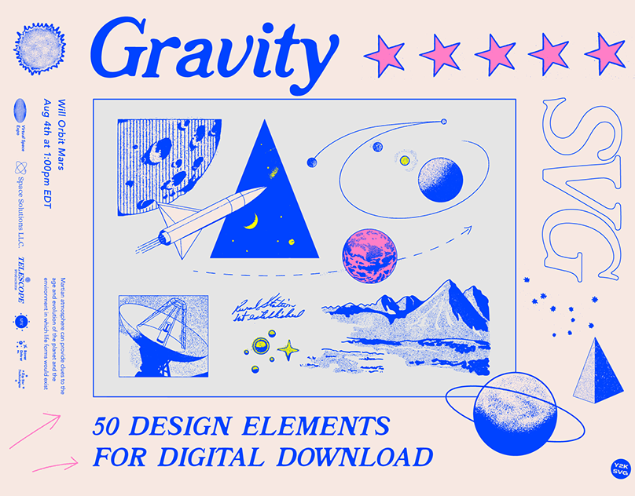

# Design Document

Polyphony is meant to FOSS, which implies that any number of people can contribute to it. In this document, I'd like to write down what my core ideas and wishes for Polyphony are, which might aid in contributing to the project in a matter that actually brings the project forward.

## Performance

Performance is important - to a degree. **The client should feel snappy and responsive at all times.** This does not mean that everything else has to be sacrificed, to squeeze out those last nanoseconds of performance. Basically: Be noticably faster than Discord :troll_emoji::

## Accessibility

A release build of Polyphony has to be accessible to everyone. This includes, but is not limited to

- Assuring a screenreader-friendly experience
- Including a colorblindness mode (for default UI elements and themes; If someone themes their client to be absolutely unusable, that's not on us)
- Including a high-contrast mode if neccessary (it most likely is)
- Adding scaling to the applications' settings (50-300% scaling of everything)
- Keeping UI elements easy to identify

 Unlike maybe some other things in this document, this is absolutely non-negotiable.

## Extensibility

Try providing extensibility wherever it's **needed**. Good interfaces, reusable functions and a generally easy-to-read code-style all fall under that category.

Having add-on/plugin support would also be amazing c:

## Theme

- Neo-Retro
- Serif display fonts radiate a certain "warmness" which I really like
- <https://web.archive.org/web/2/https://go.nebula.tv/lifetime/>
- 
- 
- Subtle-ish design to not be offensive and focus the attention on the functionality rather than the design
